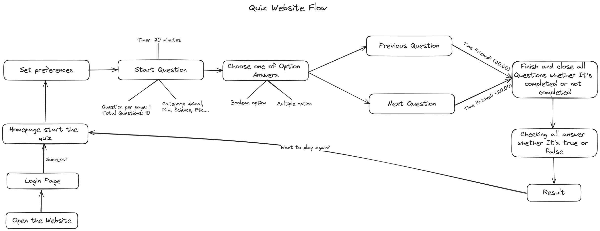

  <h1>Quizkuy</h1>
  
Unleash the Fun, One Quiz at a Time

## Quizkuy Flow

## Tech Stack

- React JS
- Typescript
- Tailwind CSS w/shadcn-ui
- React Query
- Jotai

## Screenshots

|                                                                       |                                                                       |
| :-------------------------------------------------------------------: | :-------------------------------------------------------------------: |
|  |  |
|  |  |
|  |  |

## Link

- [Repo](https://github.com/haikelz/quizkuy)
- [Live Website](https://quizkuy.ekel.dev/)

## Getting Started

A. Prerequisites

- Node.js (Latest Version).
- Docker (optional).

B. Process

- Clone this repo.
- Install all dependencies with `pnpm install`.
- Run this project with `pnpm run dev` and see the result in `http://localhost:3000`. You can also run this project using Docker. Start your Docker first and type `docker compose up --build` in your terminal.
